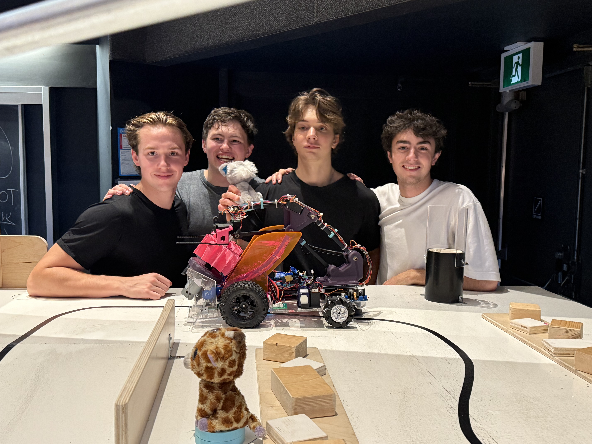
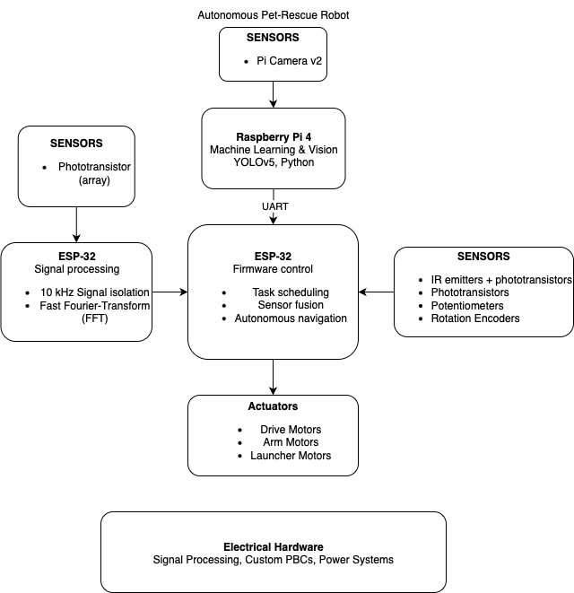

# Autonomous Pet-Rescue Robot

<caption><b>Team 6 Group Photo (left to right): Logan Hilbert, Joshua Himmons, Jack Polloway (Me), Ed Ashenhurst</b></caption>

  

_A 3rd place 🥉 autonomous robot built entirely **from scratch** - integrating ESP-IDF/FreeRTOS firmware, Python-based signal processing, YOLOv5 computer vision, and advanced robotic control algorithms._

---

## Overview

We designed, built, and programmed an autonomous pet-rescue robot over two months, working ~80 hours/week in a dedicated project lab, for the **Engineering Physics summer robotics competition.** Teams of 4 were tasked with designing an autonomous robot to complete a two-minute rescue challenge. The course featured ramps, debris, and elevated platforms, with plush "pets" hidden throughout. Robots had to detect the pets, retrieve them, and return them safely to a designated zone or by using a final zipline. Strict rules, such as fitting inside a 12x12x12 size limit, placed heavy constraints on the design.

<caption><b>Robot Competition Course Layout</b></caption>

  

--- 

## Technical Highlights

- **Custom hardware**: Designed and fabricated all PCBs and electrical circuits in-house.
- **Full-stack control**: Firmware in **C** using **ESP-IDF + FreeRTOS**; computer vision on Raspberry Pi 4.
- **Perception & ML**: Custom-trained **YOLOv5** Nano model for live object detection with optimized hyperparameters.
- **Signal processing**: FFT-based IR beacon tracking and frequency-specific control.
- **Multi-sensor navigation**: IR line following with phototransistors and emitters, beacon localization, and ML vision.
- **Advanced actuation**: Robotic arm with **inverse kinematics**; flywheel launcher for object evacuation.

<caption><b>CAD Model of the Final Design</b></caption>

  

---

## Results
- **Finalist** in competition with consistently 60% pet rescue.
- Reduced navigation and targeting errors by 50% through sensor calibration and ML tuning.
- Integrated hardware, firmware, and ML with no major system failures during final runs.
- Achieved stable 10+ FPS real-time object detection on Raspberry Pi 4 with YOLOv5 Nano.

<caption><b>Full Robot Competition Run (10x Speed)</b></caption>

  

---

## Technical Deep Dive

<caption><b>Figure 1: System Architecture Diagram</b></caption>

  

 

### Embedded Architecture

Designed for modularity and fault-tolerance, the software stack integrates real-time control with high-level telemetry across a dual-core architecture:

* **FreeRTOS ESP32 Stack:** A main ESP32 orchestrated the drive, arm, and launcher tasks `src/complete_robot/complete_robot_main.c`, while a second board handled the beacon alignment and high-speed telemetry, and a Raspberry Pi running embedded Linux handled computer vision. Everything on an ESP32 ran as FreeRTOS tasks so the PID line follower, arm inverse kinematics, and shooter safety interlocks could run concurrently without starving each other.
* **Line Following PID:** The `lib/tasks/drive_system.c` task reads dual IR reflectance sensors at 10 ms intervals and applies a PID correction around a 900 mV midpoint. When both sensors see floor, we fall back to a slow spin using the last-known line side—this saved countless runs during testing.
* **Pet Retrieval & Perception:** We encapsulated the arm driver within `lib/logic/sweep.c` to manage autonomous retrieval. The system arcs the base servo to scan for targets using either IR sensors (detecting voltage dips) or Computer Vision (via UART). Upon detection, the robot centers on the target, executes a coordinated reach/close/retract sequence, and returns the task to a FreeRTOS idle state.

<caption><b>Pet Retreival & Line Following Demo</b></caption>

  <video src="https://github.com/user-attachments/assets/c67e97f7-d7c6-4598-a8e3-ca60bf238dcb" width="600" controls="controls"></video>

* **Inter-Board Communication:** `lib/serial_comm/serial_protocol.c` packages control frames into framed JSON over UART so either ESP32 (or the Python desktop app and Raspberry Pi) can push PID gains, arm poses, or fire commands. Each packet is mutex guarded to keep telemetry streaming while commands update.
* **Python Telemetry:** `python/serial_monitor_gui.py` is our Tkinter cockpit. It auto-discovers serial devices, streams JSON into live charts, and exposes sliders for servo angles, Inverse Kinematic X/Y/θ targets, and shooter toggles. During integration we ran this alongside the FreeRTOS telemetry task that emits sensor voltages, basket lock status, and PID internals every 100 ms.
* **Beacon Digital Signal Processing (DSP):** The ESP32 responsible for beacon tracking samples the IR photodiode at 50 kS/s and runs an arbitrary-frequency Goertzel transform (`src/ir_reciever/reciever_main.c`) to extract the 1 kHz rescue beacon versus 10 kHz noise. We steer by maximizing the 1 kHz magnitude and mirror the results to a DAC channel for quick scope debugging.
* **Inverse Kinematics (IK):** We implemented a closed-form geometric solution to translate high-level $(x,y,\theta)$ commands into precise joint angles. The solver includes a bounding box check that rejects unreachable coordinates before they reach the servo drivers, ensuring the arm never attempts to fold into the chassis or overextend during autonomous retrieval.

<caption><b>Arm Pose/Trajectory Visualization</b></caption>

  

### Electrical Architecture

The robot's electrical systems were broken down into three PCBs (fabricated at JLCPCB):

* **Brain PCB:** Hosts an ESP32-WROOM module, pluggable headers for every peripheral (IR sensors, MG90S servos, beacon photodiodes, shooter FET), level shifting, and an event-button interface.

<caption><b>Brain PCB CAD Model</b></caption>

  

<caption><b>Brain PCB Circuit Diagram</b></caption>

  

* **H-Bridge PCBs:** A four-channel MOSFET stage with optocoupled logic, a BJT clamp, and high-side drive transistors so we could source current into 12 V motors without toasting GPIO. Missing current-limit resistors on the optocouplers meant extra rework, but once fixed the FreeRTOS `h_bridge` driver could ramp both sides with mutex-protected LEDC updates.

<caption><b>H-Bridge PCB CAD Model</b></caption>

  

<caption><b>H-Bridge PCB Circuit Diagram</b></caption>

  

* **Power Distribution PCB:** Breaks a 15 V LiPo into fused rails for logic, arm, and launcher subsystems.

<caption><b>Power Distro PCB CAD Model</b></caption>

  

<caption><b>Power Distro PCB Circuit Diagram</b></caption>

  

### Mechanical Systems

Every model was made in OnShape and split fabrication across laser-cut PMMA, milled aluminum brackets, and 3D printed TPU/PLA. Some highlights include:

* Dual shrouds shielded the IR line sensors and the beacon photodiodes from arena lighting, tightening our ADC noise spread (and justifying the low-pass filtering in firmware).
* The arm combines 3D printed links with laser-cut Delrin grabbers.
* The flywheel launcher uses TPU wheels with embedded brass nuts and steel bead pockets. We paused prints to insert weights, then sealed them to add rotational inertia.

<caption><b>Flywheel Launcher Demo</b></caption>

  <video src="https://github.com/user-attachments/assets/b67d5974-4e04-4dbf-9320-267533705a19" width="600" controls="controls"></video>

---

## Technologies Used
* **Hardware:** ESP32 microcontroller, Raspberry Pi 4 + Pi Camera, MG996R servos, ToF sensors (VL6180X), Hall effect sensors, IR emitters & phototransistors, custom PCBs.

* **Software & Firmware:** ESP-IDF, FreeRTOS, C, Python, YOLOv5, OpenCV, NumPy, Matplotlib, TensorFlow Lite.

* **Signal Processing:** FFT-based detection & filtering, band-pass IR frequency tracking.

* **Tools:**: KiCad, OnShape, VS Code, Platform IO, GitHub, Logic Analyzer, Oscilloscope, Linux SSH.

---

## My Contributions
**Role:** Software & Electrical Systems Engineer  

- **Machine Learning & Computer Vision:**
  - Custom-trained YOLOv5 Nano model for detecting pets on-course.
  - Tuned hyperparameters, validated model accuracy, and benchmarked performance.
  - Optimized Raspberry Pi OS (Linux based) for real-time inference:
    - Overclocking
    - SSH development workflow
    - Performance profiling and bottleneck removal
  - Integrated ML output with robotic arm targeting via UART communication.

- **Signal Processing:**
  - Designed FFT-based algorithms to detect a 10 kHz central IR beacon for positional tracking.
  - Built FFT-based IR emission/reception for autonomous control, filtering specific frequency bands.
  - Applied convolutional signal matching on IR sensor streams to robustly identify “pet” targets and filter out environmental noise.

- **Firmware Development:**
  - Wrote FreeRTOS tasks for navigation, arm control, and sensor fusion on ESP32.
  - Implemented custom sensor drivers and UART drivers for Pi–ESP32 communication.
  - Used thread-safe practices by incorperating mutexes, semephores, and event groups for inter-task dependencies
  - Developed Python GUIs for validating and testing sensor data and hardware.
  - Engineered inverse kinematic algorithms.

- **Electrical Hardware:**
  - Designed PCB layouts for motor drivers, sensor interfaces, and communication buses.
  - Built custom H-bridges for DC motor control.
  - Defined electrical architecture to integrate all subsystems safely and efficiently.

---

## Notable Challenges

- **IR Interference from Environment:**  
  *Issue:* Sunlight and other IR sources caused erratic sensor behavior.  
  *Solution:* Added FFT filtering to isolate specific IR frequency bands (10 kHz), though we learned to apply stricter band-pass processing earlier in future designs.

- **ADC Sampling Instability in ESP-IDF:**  
  *Issue:* Sampling ADC at 0.1 ms intervals caused timeouts and corrupted readings.  
  *Solution:* Rewrote sampling system with strategic task timing and priority management in FreeRTOS.

- **Concurrency & Communication Stability:**  
  *Issue:* Serial communication between GUI and ESP32 caused data corruption and crashes.  
  *Solution:* Introduced mutexes, semaphores, and thread-safe buffers to prevent race conditions.

---

## Links

-  [ESP-IDF Firmware Repository](https://github.com/enph-summer-2025/rollingohms)
-  [Machine Learning Repository](https://github.com/enph-summer-2025/computer_vision)  
-  [PCB Design Repository](https://github.com/enph-summer-2025/rollings-ohms-pcbs)  
-  [Signal Processing Repository](https://github.com/enph-summer-2025/ir_esp) 
-  [Demo Video](https://drive.google.com/file/d/1vrrbmOzqqDvycMX8IW5s0msy8z-JhquK/view?usp=share_link)
-  [Google Drive](https://drive.google.com/drive/folders/1pfD4E5x2K_xVr7HdItIgMcFwQVXqLsNb?usp=share_link)

---

## Media Coverage
- **Interview Feature:** [UBC Engineering Physics students race to save ‘pets’ with robots](https://vancouver.citynews.ca/2025/08/07/vancouver-ubc-robots-engineering-physics/)
- **Competition Overview:** [UBC robot competition demonstrates student skill, perseverance](https://www.ctvnews.ca/vancouver/article/ubc-robot-competition-demonstrates-student-skill-perseverance/)

---
